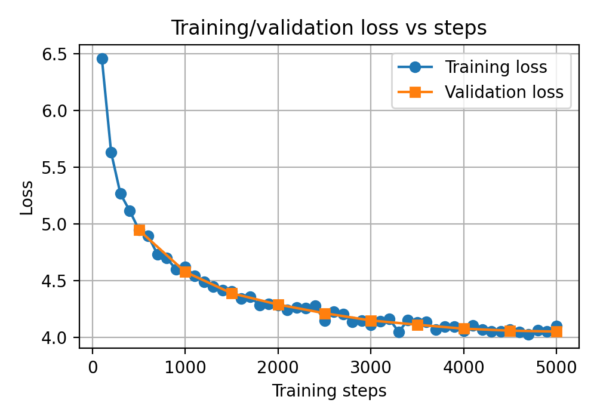

# CS336 Spring 2025 Assignment 1: Basics

## Transformer LM under Strict Compute Budget

This repo implements and trains a decoder-only Transformer language model from scratch on OpenWebText

### Model and training configuration
- Vocabulary size: 32,000
- Context length: 256
- Batch size: 256
- Maximum iterations: 5,000
- Peak learning rate: 1e-3
- Model dimension (`d_model`): 512
- Number of layers: 4
- Number of attention heads: 16
- Feed-forward dimension (`d_ff`): 1344
- RoPE theta: 10,000
- Minimum learning rate: 1e-5
- Warmup iterations: 100
- Weight decay: 0.1

### Dataset

- Training data: `/workspace/data/owt_train.npy`
- Validation data: `/workspace/data/owt_valid.npy`

### Token budget

The total number of processed tokens was:

`batch_size × max_iters × context_length = 256 × 5000 × 256 = 327,680,000`

### Final result

- Final validation loss: **4.0514**, beats baseline 5.0
- Total wallclock training time in hours: **0.57 hours**, within the **1.5 H100-hour** budget

### Validation curve



For a full description of the assignment, see the assignment handout at
[cs336_spring2025_assignment1_basics.pdf](./cs336_spring2025_assignment1_basics.pdf)

If you see any issues with the assignment handout or code, please feel free to
raise a GitHub issue or open a pull request with a fix.

## Setup

### Environment
We manage our environments with `uv` to ensure reproducibility, portability, and ease of use.
Install `uv` [here](https://github.com/astral-sh/uv) (recommended), or run `pip install uv`/`brew install uv`.
We recommend reading a bit about managing projects in `uv` [here](https://docs.astral.sh/uv/guides/projects/#managing-dependencies) (you will not regret it!).

You can now run any code in the repo using
```sh
uv run <python_file_path>
```
and the environment will be automatically solved and activated when necessary.

### Run unit tests


```sh
uv run pytest
```

Initially, all tests should fail with `NotImplementedError`s.
To connect your implementation to the tests, complete the
functions in [./tests/adapters.py](./tests/adapters.py).

### Download data
Download the TinyStories data and a subsample of OpenWebText

``` sh
mkdir -p data
cd data

wget https://huggingface.co/datasets/roneneldan/TinyStories/resolve/main/TinyStoriesV2-GPT4-train.txt
wget https://huggingface.co/datasets/roneneldan/TinyStories/resolve/main/TinyStoriesV2-GPT4-valid.txt

wget https://huggingface.co/datasets/stanford-cs336/owt-sample/resolve/main/owt_train.txt.gz
gunzip owt_train.txt.gz
wget https://huggingface.co/datasets/stanford-cs336/owt-sample/resolve/main/owt_valid.txt.gz
gunzip owt_valid.txt.gz

cd ..
```

